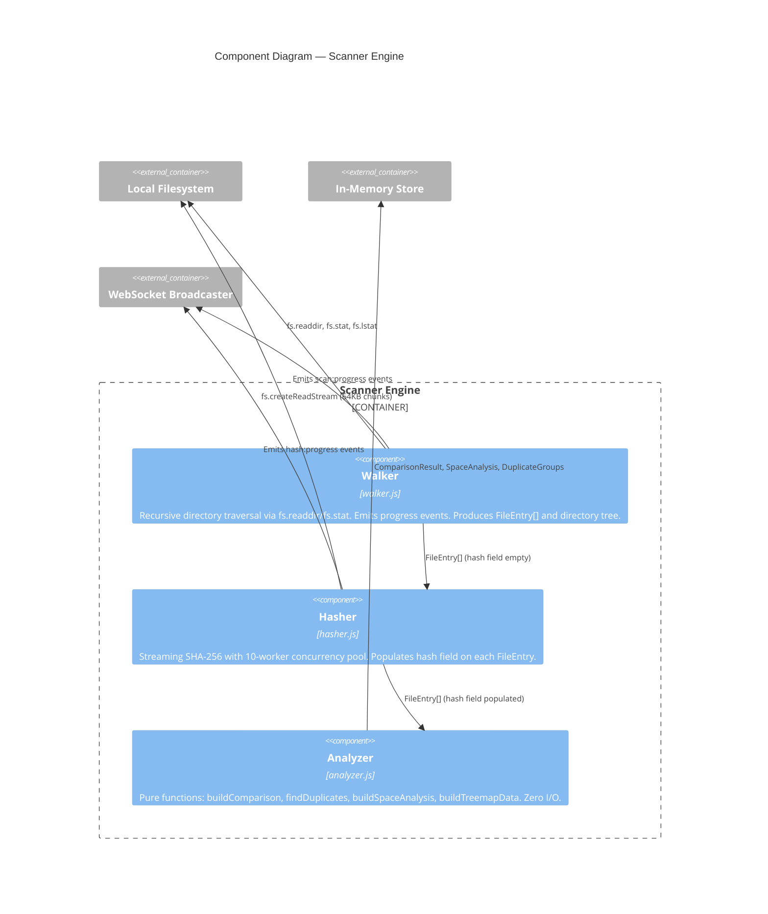

# C4 Level 3 -- Component Diagram (Scanner Engine)

The Scanner Engine is the most complex container in Mondor Commander. It consists of three components with a clear data pipeline: Walker produces file metadata, Hasher enriches it with content hashes, and Analyzer builds derived data structures for the API.

## Component responsibilities

### Walker (`walker.js`)
- Recursive directory traversal using `fs.readdir` with `withFileTypes`
- Builds relative paths, collects file metadata (size, modified, permissions)
- Respects `maxDepth`, `exclude` patterns, and `followSymlinks` config
- Emits `progress` events every 100 files via EventEmitter
- Builds a nested tree structure for the frontend
- Exports `humanSize()` utility

### Hasher (`hasher.js`)
- Streaming SHA-256 using Node.js `crypto.createHash`
- Concurrency-limited worker pool (`CONCURRENCY = 10`)
- 64KB chunk size for stream reads
- Skips files exceeding `maxFileSize` (marks as `not-hashed:too-large`)
- Handles read errors gracefully (marks as `error:MESSAGE`)
- Progress callback fires every 50 files

### Analyzer (`analyzer.js`)
- **Pure functions** -- zero I/O, highest testability
- `buildComparison()`: Uses Maps for O(1) path lookup. Classifies files as onlyLeft, onlyRight, common (matching hash), or modified (different hash)
- `findDuplicates()`: Groups files by hash using a Map. Calculates wasted space. Sorts by waste descending
- `findDuplicatesCross()`: Combines files from both scans, then delegates to `findDuplicates()`
- `buildSpaceAnalysis()`: Groups by extension and directory. Builds treemap data. Finds largest/empty files
- `buildTreemapData()`: Builds a nested size tree for the treemap visualization

## Design rationale

The pipeline pattern (Walker -> Hasher -> Analyzer) provides clear separation of concerns:
- Walker handles I/O complexity (permissions, symlinks, excludes)
- Hasher handles concurrency complexity (worker pool, streaming)
- Analyzer handles domain logic (comparison, deduplication, aggregation)

This separation makes Analyzer trivially testable (44 unit tests with zero mocking) and keeps I/O-dependent code isolated to Walker and Hasher.
