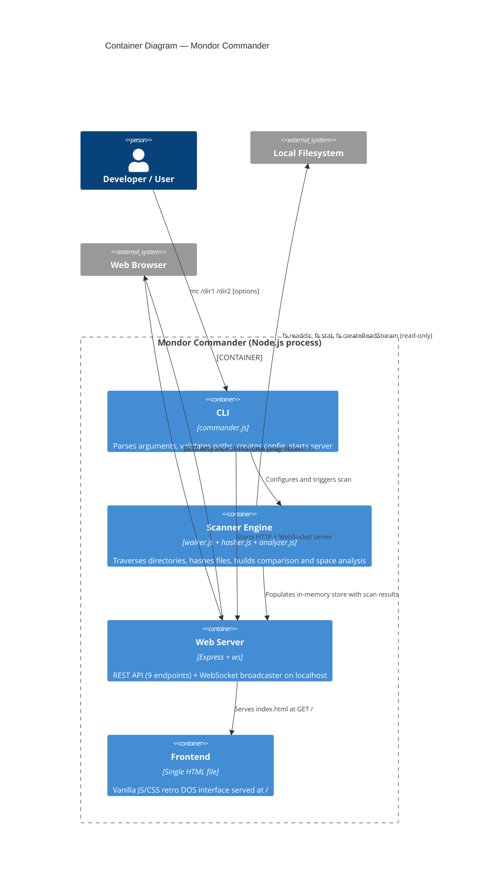

# C4 Level 2 -- Container Diagram

Shows the internal containers (processes/applications) that compose Mondor Commander.

The system runs as a single Node.js process. The "containers" here are logical groupings within that process, not separate deployable units. This is appropriate for a CLI tool -- there is no microservice decomposition to perform.

## Data flow summary

1. **CLI** parses arguments and creates a config object
2. **CLI** starts the **Web Server** (Express + WebSocket) on `127.0.0.1:PORT`
3. **CLI** triggers the **Scanner Engine** in the background
4. **Scanner** reads the filesystem: Walker traverses, Hasher computes SHA-256, Analyzer builds indexes
5. **Scanner** writes results to the in-memory store; WebSocket broadcasts progress
6. **Browser** loads the **Frontend** and fetches data from the REST API
7. All state is in-memory -- nothing is persisted to disk

## Why a single process

A CLI tool does not benefit from multi-process architecture. The user runs `mc`, it scans, it shows results, the user closes it. There is no need for a separate database process, worker queue, or background service. The single-process model keeps installation trivial (`npm install -g`) and startup fast.
