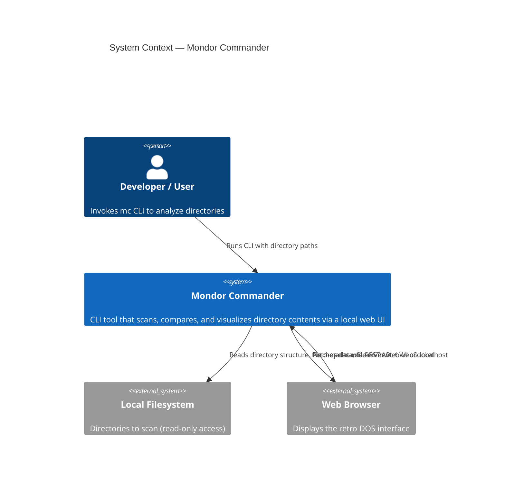

# C4 Level 1 -- System Context Diagram

Shows Mondor Commander as a black box and its interactions with external actors and systems.

Mondor Commander is a **local CLI tool** -- it has no cloud dependencies, no database, and no network services beyond the localhost web server it starts for its own UI. The only external interactions are reading the local filesystem and serving a web UI to the user's browser.

## Key decisions reflected

- **No cloud or network dependency**: The tool is fully self-contained. The user provides local directory paths; the tool reads them and presents results locally.
- **Read-only filesystem access**: Mondor Commander never writes, modifies, or deletes files. This is a core safety guarantee.
- **Localhost-only server**: The web server binds to `127.0.0.1`, making it inaccessible from the network. No authentication is needed because only the local user can reach it.
