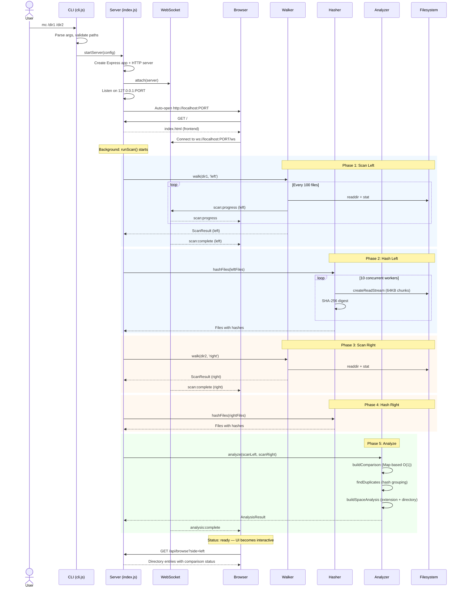

# Sequence Diagram -- Scan-to-Ready Flow

Documents the full lifecycle from CLI invocation to the frontend becoming interactive. This is the primary runtime flow of Mondor Commander.

## Key timing observations

- Phases 1-4 are **sequential** (left scan, left hash, right scan, right hash). This simplifies the code but means the total scan time is the sum of both directories.
- Phase 5 (analysis) is **CPU-bound, pure computation**. It runs synchronously on the main thread. For very large scans this could block the event loop briefly.
- The browser connects early (during scanning) and receives progress events in real-time via WebSocket. The UI shows a progress indicator until `analysis:complete` arrives.
- The `/api/*` endpoints return HTTP 202 while scanning/analyzing, and full data once `ready`.
