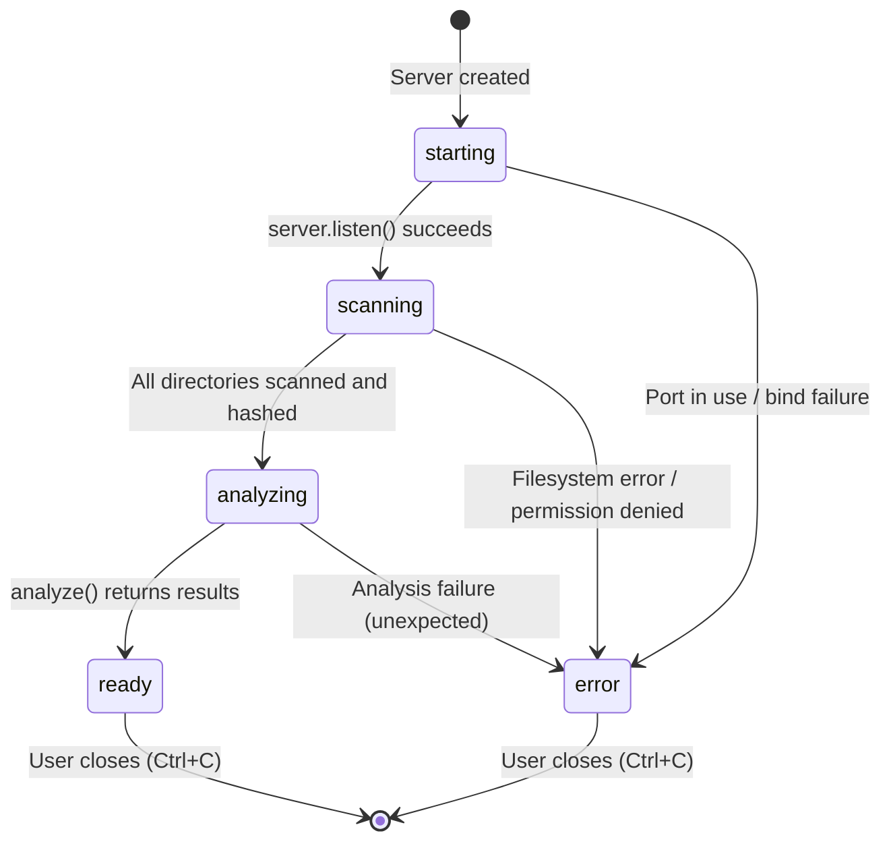

# State Diagram -- Application Lifecycle

Documents the server state machine from startup to ready. The state drives API behavior: most endpoints return HTTP 202 until the state reaches `ready`.

## State descriptions

| State | `store.status` | API behavior | WebSocket events |
|-------|---------------|--------------|------------------|
| **starting** | *(not yet set)* | Server not yet listening | None |
| **scanning** | `'scanning'` | Most endpoints return `202 { status: 'scanning' }` | `scan:progress`, `scan:complete` |
| **analyzing** | `'analyzing'` | Most endpoints return `202 { status: 'analyzing' }` | None (CPU-bound) |
| **ready** | `'ready'` | All endpoints return full data | `analysis:complete` (once) |
| **error** | `'error'` | Endpoints may return partial data or 404 | `error` (once) |

## API response matrix by state

| Endpoint | scanning | analyzing | ready |
|----------|----------|-----------|-------|
| `GET /api/status` | 200 (status + progress) | 200 (status) | 200 (status) |
| `GET /api/scan/left` | 202 | 200 (summary) | 200 (summary) |
| `GET /api/browse` | 404 (no scan data) | 200 (partial) | 200 (full with status) |
| `GET /api/compare` | 202 | 202 | 200 (comparison data) |
| `GET /api/duplicates` | 202 | 202 | 200 (duplicate groups) |
| `GET /api/space/*` | 202 | 202 | 200 (space analysis) |
| `GET /api/file-content` | 404 (no scan data) | 200 | 200 |

## Design rationale

The state machine is deliberately simple -- no state loops, no complex transitions, no external triggers beyond the initial scan pipeline. This reflects the tool's nature: start, scan, analyze, done. There is no "re-scan" or "refresh" capability. If the user wants to re-scan, they restart the process.
